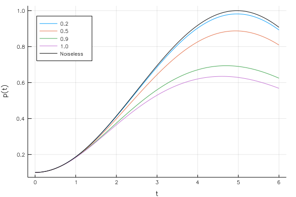

# QuantumSpatialSearch
[](http://arxiv.org/abs/1809.01969) [](http://dx.doi.org/10.5281/zenodo.1410138)

`QuantumSpatialSearch` simulates a spatial search algorithm using a continuous time quantum walk (CTQW) on an arbitrary graph, described by its adjacency matrix. It also simulates the effects of dynamic random telegraph noise (RTN) affecting the links of the graph, by Montecarlo-sampling the noise and averaging the quantum trajectory.

This Julia 1.0 package is used to obtain the numerical results of the manuscript M. Cattaneo, M. A. C. Rossi, M. G. A. Paris, S. Maniscalco, *Quantum spatial search on graphs with dynamical noise*, [arXiv:1809.01969](https://arxiv.org/abs/1809.01969).

# Installation
You can install the package using the Pkg-REPL, which is entered from the Julia REPL using the key `]`.

```sh
(v1.0) pkg> add https://github.com/matteoacrossi/QuantumSpatialSearch.git
```

You can then test that everything works as expected
```sh
(v1.0) pkg> test QuantumSpatialSearch
```

# Usage
The main function is `spatialsearch`

```julia
        (p, t, pmax, tmax) = spatialsearch(psi0, Adjacency; kwargs...)
```

which returns a `NamedTuple` consisting of

- `p`: the probability of finding the walker in the target node as a
f unction of `t`
- `t`: the time instants at which probArray is evaluated
- `pmax`: the maximum probability
- `tmax`: the optimal time at which `pmax` is reached for the first time

## Arguments
- `psi0`: a complex vector representing the initial state
- `Adjacency`: a function that returns a sparse adjacency matrix for the desired
        graph topology

### Keyword arguments
- `maxdt::Real = 0.05`: maximum allowed dt for the output
- `gamma::Real = 1.`: Coupling γ in the Hamiltonian
- `posW::Integer = 1`: Position of the target node
- `time::Real = 1.`: Final time
- `mu::Real = 1.`: Switching rate μ of the noise
- `noiseStrength::Real = 0.`: Coupling ν to the noise (noise stregth)
- `noiseRealizations::Integer = 1`: Number of Montecarlo noise realizations
- `dysonOrder::Integer = 4`: Order of the Dyson series expansion

## Graph adjacency matrix
The package provides functions for creating the adjacency matrix of the **complete graph** (`complete_graph_Ad(N)`) and **star graph** (`star_graph_Ad(N)`), where `N` is the order of the graph. Custom graph topologies can be defined.

## Distributed computing
The package automatically evaluates the Montecarlo trajectories in a distributed way, using Julia's `Distributed` package.

```julia
using Distributed
addprocs(N_PROCS)
@everywhere using QuantumSpatialSearch

(p, t, pmax, tmax) = spatialsearch(psi0, Adjacency; kwargs...)
```

# Example
This example reproduces (in a much less accurate way) part of Fig. 2 of the manuscript, where the probability as a function of time is shown for different values of the noise strength on the complete graph.

Here parallel evaluation is used with two worker process. Evaluating this script takes less than a minute on a laptop.

```julia
using Plots
using Distributed

addprocs(2)
@everywhere using QuantumSpatialSearch

N = 10; # Order of the graph
psi0 = superposition_state(N) # Initial state

# Noiseless spatial search
noiseless = spatialsearch(psi0, complete_graph_Ad; gamma=1. / N, time=6);

# Noise strength values
nus = [0.2, 0.5, 0.9, 1.0]

# Noisy spatial search simulation with 1000 noise realizations
noisy = [spatialsearch(psi0, complete_graph_Ad;
                    gamma=1. / N,
                    time=6,
                    mu=0.01,
                    noiseStrength=nu,
                    noiseRealizations=1000) for nu in nus]

# Plots
plot(noisy[1].t, [n.p for n in noisy],
                    label=nus,
                    xlabel="t",
                    ylabel="p(t)",
                    legend=:topleft)

plot!(noiseless.t, noiseless.p, c=:black, label="Noiseless")
```

## Result

